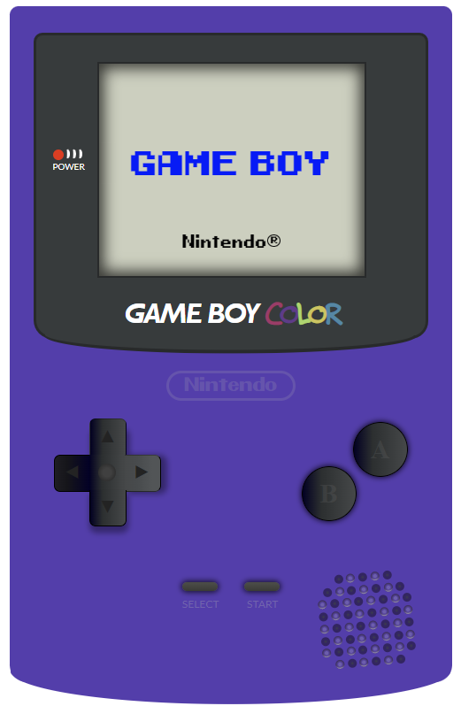

# :video_game: Video Console Project, made with HTML/CSS and JavaScript 

*If you prefer you can read this in* [Spanish](/README-ESP.md)

-------------------------------------------------

## Nintendo GameBoy Color

This is a Game Boy ***Game Boy Color*** console made with pure ***HTML / CSS / JS*** without the use of *Images, Videos or GIF.*

## How was it built

This project it's made using mostly display flex & grid, I also used position relative / absolute to be able to fix the position of some particular elements.

The display and the led are made with CSS animation, to the buttons and the audio output I've applied a gradient to be able to get an even more realistic depth effect.

The bottom part of the display is made with clip-path and, to be able to apply a border bottom, I use a div positioned under the original div with different background, so I can emulate the border bottom of the black display.

-------------------------------------------------

### How to use

You can switch on and off the GameBoy by clicking on the "Start" button, with a small JS function the display will switch on and off.

-------------------------------------------------

### Final Result

**You can see the result here: [Game Boy Color](https://germanilu.github.io/Proyecto-Videoconsola/)**

-------------------------------------------------

